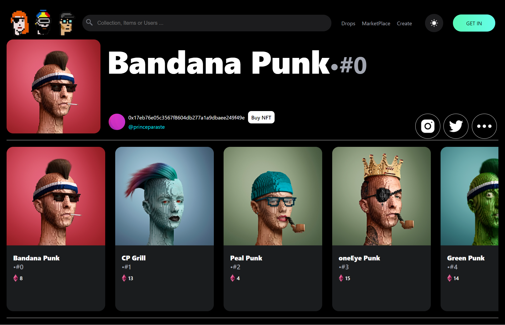

# NFT MARKETPLACE WEB APP
### An NFT is a unit of data stored on a digital ledger, called a blockchain, that certifies a digital asset to be unique and therefore, not interchangeable. NFTs can be used to represent items such as photos, videos, audio, and other types of digital files.

## APP SCREENSHOT

## Local Installation Steps: 

- `npm install`
- Create env file with variable `REACT_APP_NFT_ACCOUNT_ADDRESS=YOUR_BLOCKCHAIN_ACCOUNT_ADDRESS`
- `npm run start`
